![][art]
> "C makes it easy to shoot yourself in the foot; \
> C++ makes it harder, but when you do it blows your whole leg off". \
> — *[Bjarne Stroustrup, The Creator of C++, circa 1986][based-strous]*

## 🧙‍♂️ Hi, I'm Kurt. Here's a bit about me.
> [!TIP]
> 🌐 **Check out my website:** <https://nextredo.github.io>. Or...
> - 📜 Keep reading [this readme][gh-readme]
> - 📂 Browse [my repos][gh-repos]
> - 👷‍♂️ See [what I'm tinkering with atm][ws-repo]

### 🔙 My Past
- 🌏️ Australian
- 🤖 Mechatronics Engineering graduate
- 👔 In industry since 2023
- 📟️ Embedded Software Engineer

### 🏧 My Present
- 🐧 Linux Software Engineer
- Hobbies:
  - 🏋️‍♂️ Lift
  - 🚴‍♂️ Cycle
  - 🇩🇪 Learn German
  - 🔧 Repair & tinker

### 🔜 My Future?
- I'm interested in:
  - 🦺 Software safety
  - 💾 Robotics & embedded
  - 🐧 Linux & FOSS
  - 🌌 Space-related things
  - 🤡 Overusing emojis in readmes

### 💻️ Technologies
Check my language usage on GitHub [by searching for it here][gh-search]. Or...
- Ask me for a copy of my resume
- Visit my LinkedIn
- Just ask me `¯\_(ツ)_/¯`

### 📊 Metrics
<!-- See GitHub Actions for info on this section -->

  

    Feelin' lucky, punk?
  

  <a href="https://en.wikipedia.org/wiki/Dirty_Harry#Influence">
    Who you calling punk, punk?
   
  </a>
  

These infographics were generated using [lowlighter/metrics][metrics-gen]

### 💽 Repos (see below ⬇️)

<!----------------------------------------------------------------------------->
<!-- # Links -->
<!-- ## Internal -->
[404]: ./images/404.svg
[art]: ./images/ascii-borealis.svg

<!-- ## Personal -->
[gh-readme]: https://github.com/nextredo
[gh-repos]: https://github.com/nextredo?tab=repositories
[gh-search]: https://github.com/search?q=user%3Anextredo&type=code
[ws-repo]: https://github.com/nextredo/workshop

<!-- ## External -->
[based-strous]: https://www.stroustrup.com/quotes.html
[misquote]: https://en.wikipedia.org/wiki/Dirty_Harry
[metrics-gen]: https://github.com/lowlighter/metrics
